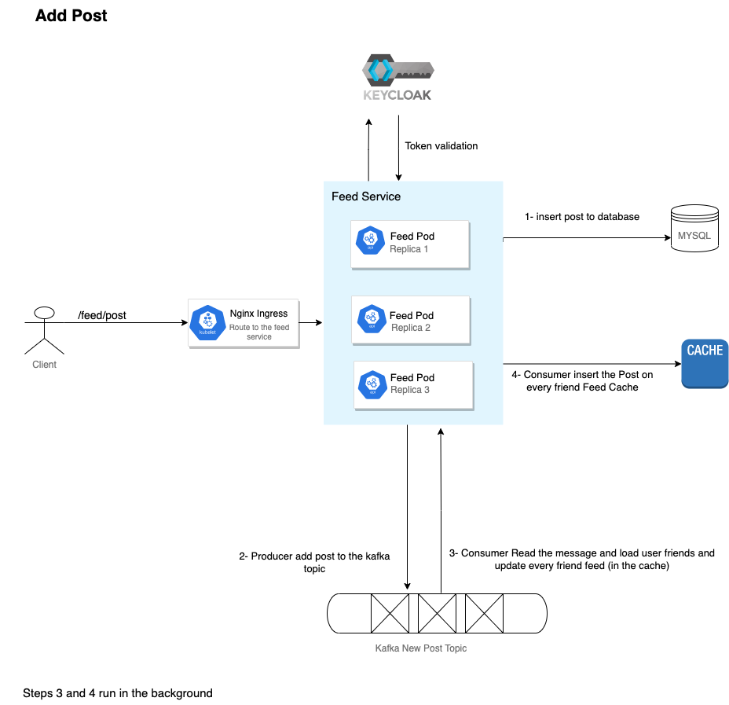

# Social Media Platform

## About Project
Implementation for social media network system using Java, Quarkus, Kafka and Hazelcast (for caching). 
I tried to write code in best practice software development and implement the architecture to achieve project security and resilience.


## Project Architecture
Goal: Load user feedand add new feed too fast
### Add Post


### Load user feed


** Note: I'm not using every service as a cache node instead I imagined there is a hazelcast cluster contains a separated nodes (pods) for caching.

## Run App Locally
Start Docker Desktop:
```shell
cd social-media-quarkus-kubernetes
docker compose up
```

#### using minikube docker environment

```shell
# Start minikube cluster
minikube start
# User minikube docker environment
eval $(minikube docker-env)

cd ${project-root-folder}
# Build project jars and docker images
mvn clean install -Dquarkus.container-image.build=true
```

#### or using local registry
```shell
docker run -d -p 5000:5000 --name registry registry:2.7
minikube start --cpus 4 --memory 4096 --insecure-registry localhost:5000
cd services/feed
docker build -f src/main/docker/Dockerfile.jvm -t social/feed:1.0 .
docker tag  social/feed:1.0 localhost:5000/social/feed:1.0
docker push localhost:5000/social/feed
kubectl apply -f target/kubernetes/kubernetes.yml
```

Add Certificates for Ingress-Nginx 
```shell
cd kubernetes/certificate
kubectl create secret tls ingress-tls --key certificate.key --cert cert.pem
```
 
Apply secrets, config-maps and ingress configurations
```shell
kubectl apply -f kubernetes/config
```

Deploy Feed and User Service
```shell
cd services/feed
kubectl apply -f target/kubernetes/kubernetes.yml

cd services/user
kubectl apply -f target/kubernetes/kubernetes.yml
```
 Run minikube tunnel to access the ingress controller
```shell
minikube tunnel
```
Update your /etc/hosts file and add the following line:
```shell
127.0.0.1 social.app
```
### Now you can access the app using:
```shell
curl https://social.app/feed/{{endpoint path}}
curl https://social.app/user/{{endpoint path}}
````
### Login curl

```shell
   curl --insecure -X POST http://localhost:8080/realms/social/protocol/openid-connect/token \
    --user backend-service:drMIoXAkomvdWhS4lZCM6IkmZ6TRJQ0h \
    -H 'content-type: application/x-www-form-urlencoded' \
    -d 'username=mostafa&password=123&grant_type=password'
```
