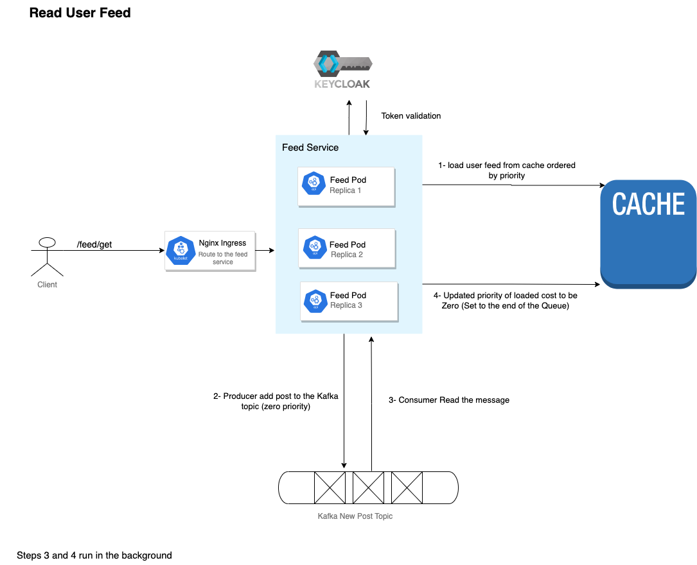

# Social Media Platform

## About Project
Implementation for social media network system using Java, Quarkus, Kafka and Hazelcast (for caching). 
I tried to write code in best practice software development and implement the architecture to achieve project security and resilience.

## Technology Stack

* Mysql (DB)
* Kafka (help in processing users feed in the background)
* Hazelcast for cache user feeds and Post caching too(I will add Redis and you can switching between them from the config).
* Keycloak project security (Authentication and Authorization)
* Java (Quarkus, JPA, ...)
## Project Architecture
Goal: Load user feedand add new feed too fast
### Add Post


### Load user feed


** Note: I'm not using every service as a cache node instead I imagined there is a hazelcast cluster contains a separated nodes (pods) for caching.

## Run App Locally on k8s

You need to have MYSQL database installed on your machine and add two schemas (social_media, keycloak), docker desktop, docker compose and minikube

** Be sure you have Docker Desktop started:

```shell
cd social-media-quarkus-kubernetes
docker compose up
```

#### using minikube docker environment

```shell
# Start minikube cluster
minikube start
# User minikube docker environment
eval $(minikube docker-env)

cd ${project-root-folder}
# Build project jars and docker images
mvn clean install -Dquarkus.container-image.build=true
```

#### or using local registry
```shell
docker run -d -p 5000:5000 --name registry registry:2.7
minikube start --cpus 4 --memory 4096 --insecure-registry localhost:5000
cd services/feed
docker build -f src/main/docker/Dockerfile.jvm -t social/feed:1.0 .
docker tag  social/feed:1.0 localhost:5000/social/feed:1.0
docker push localhost:5000/social/feed
kubectl apply -f target/kubernetes/kubernetes.yml
```

Add Certificates for Ingress-Nginx 
```shell
cd kubernetes/certificate
kubectl create secret tls ingress-tls --key certificate.key --cert cert.pem
```
 
Apply secrets, config-maps and ingress configurations
```shell
kubectl apply -f kubernetes/config
```

Deploy Feed and User Service
```shell
cd services/feed
kubectl apply -f target/kubernetes/kubernetes.yml

cd services/user
kubectl apply -f target/kubernetes/kubernetes.yml
```
 Run minikube tunnel to access the ingress controller
```shell
minikube tunnel
```
Update your /etc/hosts file and add the following line:
```shell
127.0.0.1 social.app
```
### Now you can access the app using:
```shell
curl https://social.app/feed/{{endpoint path}}
curl https://social.app/user/{{endpoint path}}
````
## Test the App Without k8s

** To test on k8s please replace http://localhost:8010/ to https://social.app/{service}/

1- Register two users

first one
```shell
curl -X POST --location "http://localhost:8010/register" \
    -H "Content-Type: application/json" \
    -d "{\"username\": \"mostafa\", \"password\": \"123\", \"firstname\": \"Mostafa\", \"lastname\": \"Albana\", \"email\": \"mostafa.albana@gmail.com\"}"  
  ```
second user

```shell
curl -X POST --location "http://localhost:8010/register" \
    -H "Content-Type: application/json" \
    -d "{\"username\": \"mostafa2\", \"password\": \"123\", \"firstname\": \"Mostafa2\", \"lastname\": \"Albana2\", \"email\": \"mostafa.albana.2@gmail.com\"}"  
  ```

2- Login (Get the OAuth token from Keycloak) (Token 1)
```shell
   curl --insecure -X POST http://localhost:8080/realms/social/protocol/openid-connect/token \
    --user backend-service:Wbw4dVq74XTlzjfXTIKizFEVodPOPmY4 \
    -H 'content-type: application/x-www-form-urlencoded' \
    -d 'username=mostafa&password=123&grant_type=password'
```

3- Send friend request
```shell
curl -X POST --location "http://localhost:8010/friend/send/{to}" \
-H "Content-Type: application/json" \
-H "Authorization: Bearer ${token1}" 
```

4- Then login with the other user (Token2)
```shell
   curl --insecure -X POST http://localhost:8080/realms/social/protocol/openid-connect/token \
    --user backend-service:Wbw4dVq74XTlzjfXTIKizFEVodPOPmY4 \
    -H 'content-type: application/x-www-form-urlencoded' \
    -d 'username=mostafa2&password=123&grant_type=password'
```

5- Confirm friend request
```shell
curl -X PUT --location "http://localhost:8010/friend/confirm/{friend-request-id}" \
-H "Content-Type: application/json" \
-H "Authorization: Bearer ${token2}"
 ```

6- Add New Post for user1 (mostafa)
```shell
curl -X POST --location "http://localhost:8020/post" \
-H "Content-Type: application/json" \
-H "Authorization: Bearer ${token1}" \
-d "{\"postBody\": \"My first post\"}"
```

7- Get the feed of user2 (mostafa2)
```shell
curl -X GET --location "http://localhost:8020/get" \
-H "Content-Type: application/json" \
-H "Authorization: Bearer ${token2}"
```